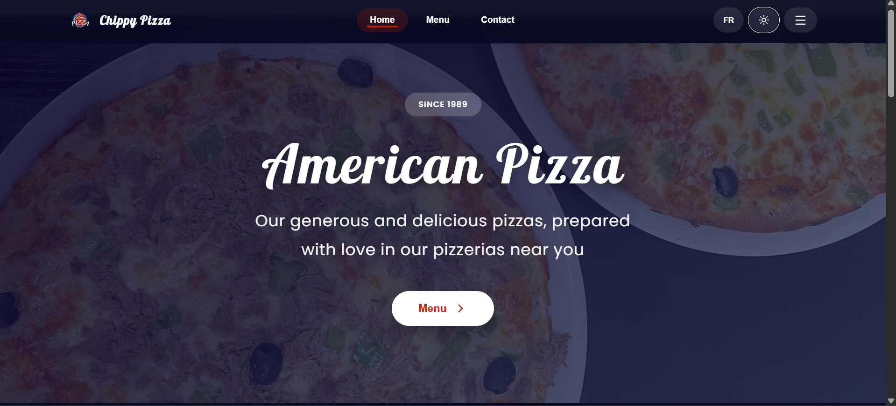

#  Chippy Pizza — React Restaurant Website



🔗 **Live Demo:** https://chippy-sand.vercel.app/

---


## ⚡ Features
- 🌓 Dark & Light mode  
- 🌍 FR / EN language switch  
- 🎨 Modern UI + smooth animations  
- 🍕 Dynamic pizza highlights  
- 🖼️ Hero carousel auto-rotate  
- 📍 Google Maps embed  
- 📱 Fully responsive  

---

## 🛠️ Tech Stack
- React 18  
- Lucide Icons  
- CSS3  
- Custom hooks (`useTheme`, `useLanguage`)  

---

## 📦 Installation

```bash
git clone https://github.com/yourusername/chippy-pizza.git
cd chippy-pizza
npm install
npm start

```


## 👩‍💻 Author

Melyna Feriel Soudani
Software Engineer • Web Developer • AI Enthusiast
